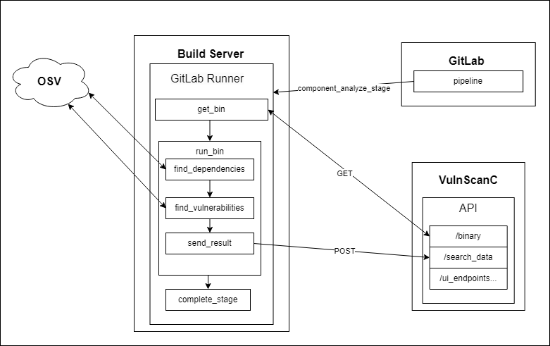

[Вернуться к основному README](../README.md)

Схема работы выглядит следующим образом:



.gitlab-ci.yml в проекте, для которого необходимо найти сторонние компоненты и уязвимости, может выглядеть следующим образом:
``` 
stages:
  - component_analyze

analyze:
  stage: component_analyze
  script:
      - wget http://$VSC_ADDRES/binary?action=get_file -O exec_module
      - chmod +x exec_module
      - ./exec_module --project_name=some_project_name --server_address='$VSC_ADDRES' --pipline_id=$CI_PIPELINE_ID
  timeout: 2h
  tags:
      - certification
  variables:
      GIT_SUBMODULE_STRATEGY: recursive
  only:
      - schedules
    
```
О работе с исполняемым модулем подробнее здесь: [Исполняемый модуль](../docs/executable_module.md)  