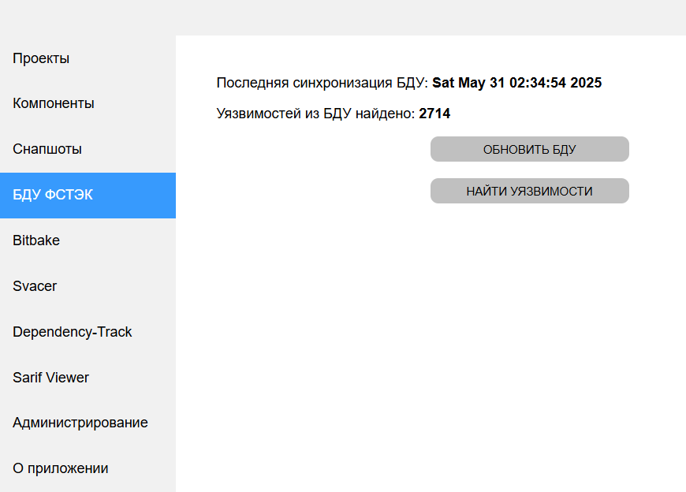

[Веб-интерфейс](../web_ui.md)

В данной вкладке можно обновить БДУ ФСТЭК и найти уязвимости из БДУ по всем компонентам (обычные проекты и Bitbake)  

При нажатии "Обновить БДУ" в сервис будет скачана последняя версия БДУ с сайта ФСТЭК  

При нажатии "Найти уязвимости" будет выполнено сопоставление всех CVE уязвимостей, находящихся в базе данных сервиса,  
с уязвимостями из БДУ. Найденные совпадения будут доступны во вкладках уязвимостей и в отчётах

