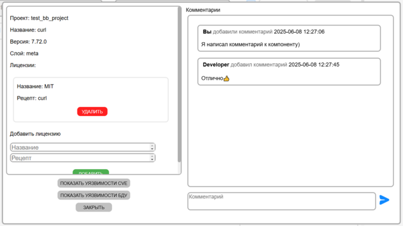
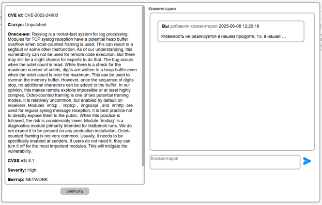

[Веб-интерфейс](../web_ui.md)

Во вкладке Bitbake можно ознакомиться с найденными в проектах Bitbake компонентами и их уязвимостями  
После выбора проекта и нужного слоя открываются найденные для него компоненты  

Ознакомиться с информацией о компоненте можно нажав на его карточку, в ней же можно оставлять комментарии  

Ознакомиться с уязвимостями, найденными в компоненте, можно с помощью кнопок "Показать уязвимости CVE" или "Показать уязвимости БДУ"  
Для предоставления подробной информации об уязвимости можно нажать на карточку уязвимости, в ней же можно оставлять комментарии

