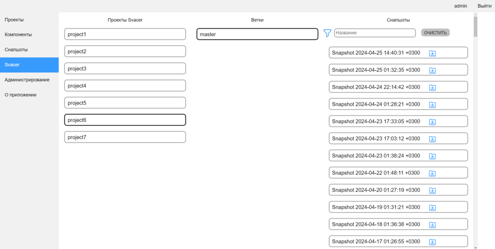

[Веб-интерфейс](../web_ui.md)

В данной влкадке можно выгрузить отчеты по снапшотам из Svacer  
Для этого необходимо выбрать интересующий проект и ветку, после чего будут загружены снапшоты  
При нажатии на карточку снапшота скачается отчет по этому снапшоту, содержащий:
- Описание уязвимостей
- Пути до файлов
- Номера строк
- Комментарии разработчиков в Svacer
- Severity

