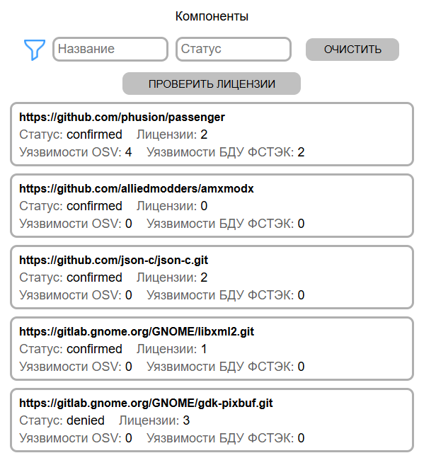

[Веб-интерфейс](../web_ui.md)

В этой вкладке можно ознакомиться с найденными в проектах компонентами и их уязвимостями  
После выбора проекта открываются найденные для него компоненты  
Каждый компонент имеет один из статусов:  
- none (статус отсутствует)
- confirmed (наличие компонента в проекте подтверждено)
- denied (наличие компонента в проекте опровергнуто)

Система статусов необходима из-за того, что эндпоинт determinversion OSV может предоставить определенный score компонента  
Score - это значение от 0 до 1, которое показывает насколько точным было совпадение найденного в проекте компонента с известными компонентами в OSV  

Ознакомиться с информацией о компоненте можно нажав на его карточку  
На основании score и ручного анализа проекта необходимо принять решение, входит ли компонент в проект, затем присвоить ему нужный статус

Ознакомиться с уязвимостями, найденными в компоненте, можно с помощью кнопки "Показать уязвимости":

