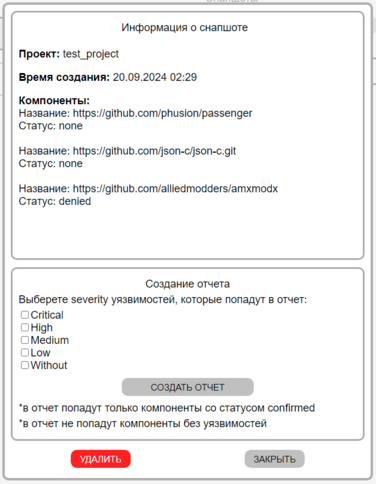

[Веб-интерфейс](../web_ui.md)

В данной вкладке можно ознакомиться со снапшотами (сохраненными состояниями операций поиска), выгрузить отчеты по ним в формате DOCX и удалить при необходимости

Для этого нужно выбрать проект и нужный снапшот  

Для создания отчета необходимо выбрать severity уязвимостей, которые попадут в отчет  
В отчет попадут только компоненты со статусом confirmed  
В отчет не попадут компоненты без уязвимостей

