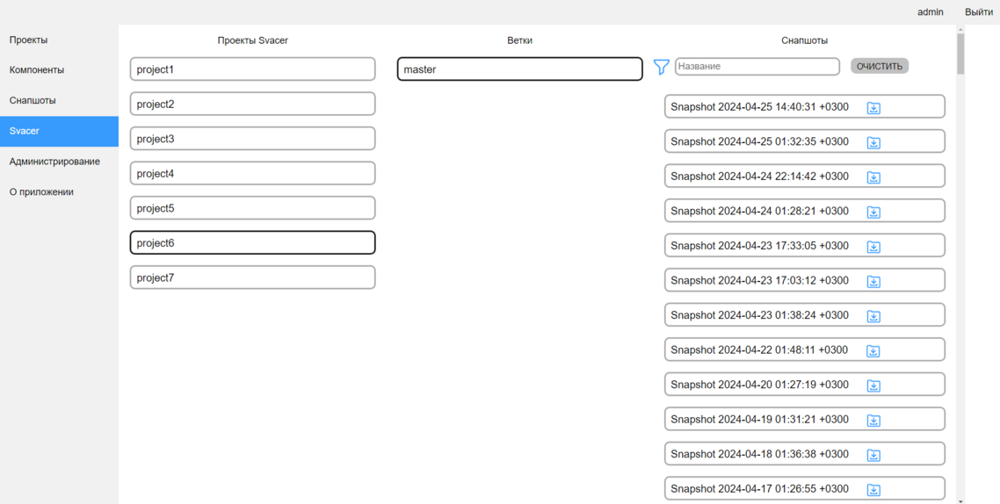

[Веб-интерфейс](../web_ui.md)

Данный функционал является устаревшим, т.к. реализовывался на момент, когда актуальной версией Svacer была 8.x.x  
В этих версиях у Svacer нет функционала генерации отчётов  
Начиная с версии 10.x.x ИСП РАН реализовал генерацию отчётов, поэтому в приоритете использование штатного генератора Svacer  

В данной влкадке можно выгрузить отчеты по снапшотам из Svacer  
Для этого необходимо выбрать интересующий проект и ветку, после чего будут загружены снапшоты  
При нажатии на карточку снапшота скачается отчет по этому снапшоту, содержащий:
- Описание уязвимостей
- Пути до файлов
- Номера строк
- Комментарии разработчиков в Svacer
- Severity

